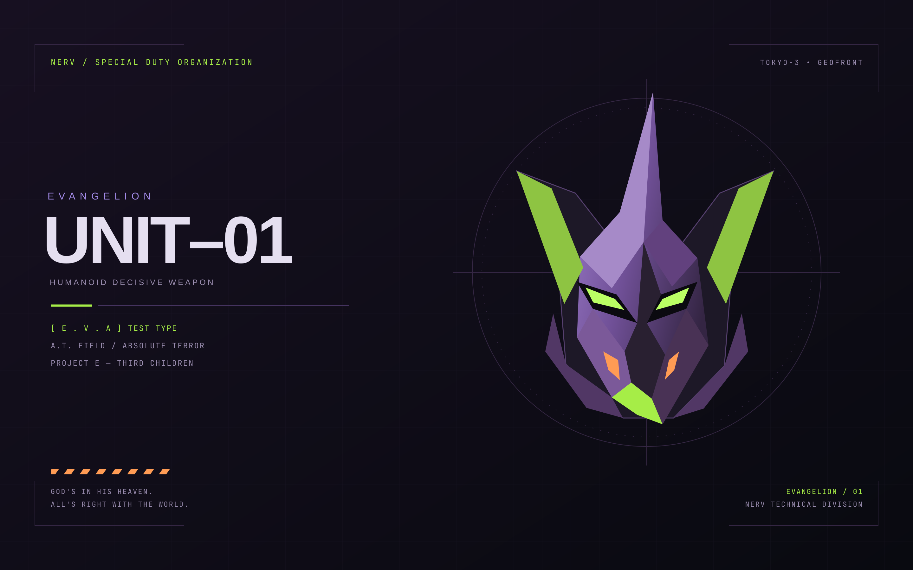

# Evangelion — Unit-01

Original 2880×1800 vector wallpaper, deep purple surfaces, acid-green accents,
orange alerts, purple icons, angular gradient borders, and a 30px status bar.
Omarchy generates matching palettes for its supported terminals, launcher,
notifications, lock screen, editors, browser, and system tools from colors.toml.
Applications may need reopening to pick up their generated theme.



## Installation

```sh
omarchy theme install https://github.com/DanielCoffey1/omarchy-evangelion-theme
```

The installer applies Evangelion automatically.

Wallpaper source: `wallpaper.svg`; rendered desktop asset: `backgrounds/01-unit-01.png`.

## Compatibility

Omarchy generates application themes and Hyprland border colors from
`colors.toml`. This repository contains no Lua or terminal configuration files,
which Omarchy does not accept from installed themes. Window gaps, rounding, and
shadows follow your existing desktop configuration.

The separately configured EVA·01 Starship prompt is not included.
